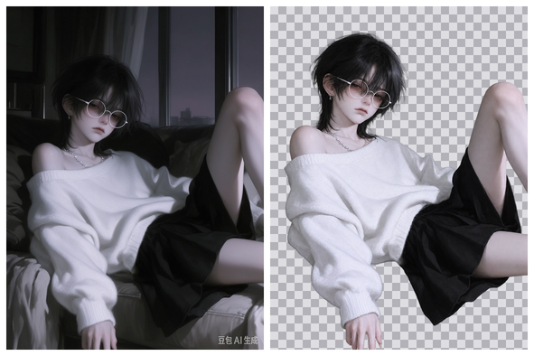

# chroma-cutout · 透明背景抠图

**给 AI Agent 用的抠图技能**：把复杂背景照片里的主体抠出来，导出带真 alpha 通道的透明 PNG。



左：原图（深色室内、沙发、地板、右下角水印）。右：抠出的透明主体，合成在棋盘格上。

**只有两步**：

```
原图 ──① 生图模型换透明背景──> 真 alpha PNG ──② 本地验收并导出──> 成品
```

不换绿幕、不做颜色 keying、不做 RGB 差分。直接要生图模型的真 alpha 输出，然后本地验收。

## 为什么不是「阈值抠图」

背景复杂时（室内、地板、笼子、墙面、文字、水印），用阈值、魔棒或多边形硬抠，边缘一定脏。让理解画面的生图模型来分离主体，边缘质量高出几个量级。

## 为什么需要第二步验收

生图模型经常**假装**给了你透明背景：它会画一张棋盘格、一片白底或灰底糊在 RGB 里。这种图在普通看图软件里看起来就是「透明」的，直接贴到别的背景上才会露馅。

`alpha_check.py` 专门抓这类假透明：查 alpha 通道是否真实存在、四角是否透明、透明像素是否为零、RGB 里有没有被画进去的棋盘格，并合成一张棋盘格 preview 供肉眼确认。

## 安装

这是一个 [Agent Skill](https://docs.anthropic.com/en/docs/claude-code/skills)：一个 `SKILL.md` 加可选的脚本和测试。

```sh
git clone https://github.com/maomaoxyz1/chroma-cutout.git
```

把整个目录放进你 Agent 的技能目录即可，例如：

| 环境 | 技能目录 |
|---|---|
| Claude Code | `~/.claude/skills/chroma-cutout/` |
| 其他支持 skills 的 Agent | 其文档里的 skills / prompts 目录 |
| Minis（iOS） | `/var/minis/skills/chroma-cutout/` |

Agent 会根据 `SKILL.md` 里的 triggers 自动触发，也可以直接说「把这张图抠成透明背景」。

## 用法

### 第一步：让生图模型输出透明背景

把原图作为参考图传给环境里已有的生图/改图能力，用 `SKILL.md` 里的提示词。三个要点：

- 明确要**真 alpha 通道**，点名不要棋盘格、白/灰底、光晕
- **逐项列出要删的东西**：文字、水印、地板、笼子、其他动物
- 要求**主体不变**（keep unchanged / no repaint）

用 OpenAI Images API 时对应参数是：

```
POST /v1/images/edits
  image=<原图>
  background="transparent"
  output_format="png"
```

### 第二步：验收

```sh
python3 scripts/alpha_check.py cutout.png -o preview.png
```

```
file=cutout.png has_alpha_channel=True
corners_alpha={'tl': 0, 'tr': 0, 'bl': 0, 'br': 0}
opaque=814939 soft=21979 transparent=735486 transparent_share=46.8%
VERDICT: OK
```

判 FAIL 时以非 0 退出，方便批处理；`-o` 输出棋盘格 preview。

## 依赖

第二步需要 Python 3 + NumPy + Pillow：

```sh
pip install numpy pillow
```

第一步依赖你自己环境里的生图模型。

## 项目结构

```
chroma-cutout/
├── SKILL.md              # 给 Agent 的指令（提示词、流程、验收标准）
├── scripts/
│   └── alpha_check.py    # 本地验收：真伪透明、四角、棋盘格检测 + preview
├── tests/
│   └── test_alpha_check.py
└── examples/
    └── demo.png
```

跑测试：

```sh
python3 -m unittest discover -s tests -v
```

## 实测数据

`gpt-image-2` + 一张 1773×2364 竖版插画（深色室内背景 + 右下角水印）：

- 输出真 RGBA，四角 alpha = 0，透明区 **46.8%**
- 姿势、眼镜、项链、发丝全部保留，水印被去掉
- 合成到深色和浅色背景上均无可见色圈
- 单张生成约 50 秒

已知坑：生图服务**可能不遵守你传的尺寸参数**——同一次请求要 1024×1792，实际返回 1086×1448。别假设输出尺寸等于输入尺寸。

## 局限

- 生图不是像素保持的：会轻微重画主体。要求像素级一致时请用确定性分割工具。
- 真 alpha 支持取决于模型和接口；拿不到就是这条路走不通，不要用画出来的棋盘格顶替。
- 一次一张。批量时逐张跑，注意限流和付费。

## 许可

MIT，见 [LICENSE](LICENSE)。
